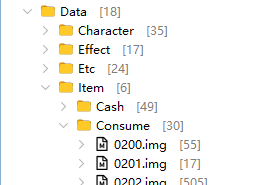
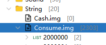

# 增加道具
## 增加消耗物品
1. 在客户端Item->Consume->大类id.img 中新增


2. 在客户端String->Consume->id 节点 中新增物品描述(鼠标hover展示的信息)


3. 在服务端Item->Consume->大类id.img.xml 中新增节点;
```xml
    <!-- 自定义道具：xy一键售卖（确认版），复制自02022078，ID=02432078 -->
    <imgdir name="02432078">
        <imgdir name="info">
            <canvas name="icon" width="27" height="29">
                <vector name="origin" x="-3" y="29"/>
                <string name="_outlink" value="Item/Consume/_Canvas/0202.img/02022078/info/icon"/>
            </canvas>
            <canvas name="iconRaw" width="27" height="27">
                <vector name="origin" x="-3" y="29"/>
                <string name="_outlink" value="Item/Consume/_Canvas/0202.img/02022078/info/iconRaw"/>
            </canvas>
            <int name="price" value="1"/>
            <int name="slotMax" value="1"/>
            <int name="tradeBlock" value="1"/>
        </imgdir>
        <imgdir name="spec">
            <string name="script" value="02432078_sell_confirm"/>
            <int name="npc" value="9900001"/>
        </imgdir>
    </imgdir>
```
4. 在客户端Item->Consume.img.xml 中新增节点;
```xml
 <imgdir name="2432076">
        <string name="name" value="一键售卖"/>
        <string name="desc" value="自动出售装备栏最后48格的所有装备,直接出售"/>
    </imgdir>
    <imgdir name="2432078">
        <string name="name" value="一键售卖 (需手动确认)"/>
        <string name="desc" value="出售装备栏最后48格的所有装备,需要手动确认"/>
    </imgdir>
```

## 新增装备


## 新增材料


## 新增NPC


## 新增地图


# WZ 资源目录速查

> 2026-06-15 整理 | 完整版见 `../冒险岛WZ资源目录完整参考.md` | 开发手册见 `WZ资源目录开发手册.md`

## 目录总览
```
wz/（16目录，~57000 .img.xml文件）
├── Base.wz(3)       渲染基础(StandardPDD/smap/zmap)
├── Character.wz(37k) 装备外观精灵(17子目录: Hair/Weapon/Face/Cap等)
├── Effect.wz(17)    视觉特效(BasicEff/Direction/SkillName等)
├── Etc.wz(24)       游戏配置(Commodity/MapNeighbors/ItemMake等)
├── Item.wz(155)     物品(6子目录: Cash/Consume/Etc/Install/Pet/Special)
├── Map.wz(5.7k)     地图(5子目录: Back/Obj/Tile/WorldMap/Map[0-9])
├── Mob.wz(2k)       怪物(+QuestCountGroup子目录)
├── Morph.wz(42)     变身/骑乘动作帧
├── Npc.wz(7.2k)     NPC外观与对话
├── Quest.wz(6)      任务系统(Act/Check/QuestInfo/Say/PQuest/Exclusive)
├── Reactor.wz(421)  地图交互对象
├── Skill.wz(76)     职业技能(+BFSkill/MobSkill/ItemSkill)
├── Sound.wz(45)     音频/BGM/音效
├── String.wz(20)    本地化字符串(名称/描述)
├── TamingMob.wz(7)  坐骑数据
└── UI.wz(19)        用户界面图形
```

## WZ 节点基础类型
| 类型 | XML | 说明 |
|------|-----|------|
| int | `<int name="price" value="100"/>` | 整数 |
| string | `<string name="islot" value="Cp"/>` | 字符串 |
| float/double | `<float name="mobRate" value="1.0"/>` | 浮点 |
| vector | `<vector name="origin" x="0" y="32"/>` | 二维向量 |
| canvas | `<canvas name="icon" width="32" height="32">` | 精灵帧 |
| uol | `<uol name=".." value="../path"/>` | 链接引用 |
| sound | `<sound name="Bgm00/FloralLife"/>` | 音频引用 |

## Consume 物品 ID 速查
| IMG | 分类 | 特征 | IMG | 分类 | 特征 |
|-----|------|------|-----|------|------|
| 0200 | HP药水 | spec.hp | 0221 | 变身药水 | spec.morph |
| 0201 | HP食物 | spec.hp | 0224 | 活动限定 | tradeBlock+only |
| 0202 | 混合药水 | spec.hp/mp/hpR/mpR | 0226 | 疲劳恢复 | spec.incFatigue(-) |
| 0203 | 传送卷轴 | spec.moveTo | 0227 | 怪物放置 | mob+create+坐标 |
| 0204 | 装备卷轴 | inc*+success | 0228~9 | 技能书 | skill+masterLevel |
| 0205 | 状态治愈 | spec.poison/darkness等 | 0233 | 高级子弹 | bullet+incPAD+reqLevel |
| 0206 | 子弹(火枪) | bullet+incPAD | 0236 | 幽灵药水 | spec.ghost=1 |
| 0207 | 飞镖(拳套) | bullet+incPAD+reqLevel | 0237 | 经验券 | spec.exp+maxLevel |
| 0210 | 怪物召唤袋 | mob(ID+概率) | 0238 | 怪物卡 | monsterBook=1+mob |
| 0212 | 魔法粉末 | spec.inc | 0243 | 任务脚本物品 | spec.script+npc |
| 0216 | 限时物品 | timeLimited=1 | 0245 | 经验Buff | spec.expBuff+time |

## 装备 islot 代码
| islot | 栏位 | ID前缀 | islot | 栏位 | ID前缀 |
|-------|------|--------|-------|------|--------|
| Cp | 帽子 | 0100 | So | 鞋子 | 0107 |
| Af | 脸饰 | 0101 | Gv | 手套 | 0108 |
| Ay | 眼饰 | 0102 | Si | 盾牌 | 0109 |
| Ae | 耳环 | 0103 | Sr | 披风 | 0110 |
| Ma | 上衣 | 0104 | Ri | 戒指 | 0111 |
| MaPn | 套服 | 0105 | Pe | 项链 | 0112 |
| Pn | 裤子 | 0106 | Wp | 武器 | 0120~0170 |
| Be | 腰带 | 0113 | Me | 勋章 | 0114 |
| Tm | 坐骑 | 0190 | Fc/Hair/Bd | 脸/发/皮肤 | 0000~0003 |

## 地图 info 关键属性
| 属性 | 说明 | 属性 | 说明 |
|------|------|------|------|
| bgm | 背景音乐 | town | 1=城镇 |
| returnMap | 死亡回城 | forcedReturn | 强制返回 |
| mobRate | 怪物刷新倍率 | fieldLimit | 场地限制标志 |
| swim | 1=游泳 | fly | 1=飞行 |
| onUserEnter | 进入脚本 | mapMark | 小地图文字 |

### 地图子节点
- **back:** 背景图层(x/y/rx/ry/a/bS)
- **life:** NPC/怪物生成(type/id/x/y/fh/cy/rx0/rx1)
- **foothold:** 立足点(3层, x1/y1-x2/y2链式, prev/next)
- **portal:** 传送门(pn/pt/tm/tn/x/y), pt:0=出生点,1=隐藏,2=常规,3=触碰,7=脚本

## 怪物 info 属性
| 属性 | 说明 | 属性 | 说明 |
|------|------|------|------|
| level | 等级 | maxHP/maxMP | HP/MP |
| PADamage | 物理攻击 | PDDamage/MDDamage | 物理/魔法防御 |
| acc/eva | 命中/回避 | exp | 经验值 |
| speed | 移动速度(负=慢) | undead | 1=不死系 |
| boss | 1=BOSS | summonType | 0不召唤/1小怪/2同族 |
| mobType | 0普通/1不死/2飞行/3BOSS | fs | 击退力系数 |

## 技能 level 属性
| 属性 | 说明 | 属性 | 说明 |
|------|------|------|------|
| mpCon/hpCon | MP/HP消耗 | damage | 伤害% |
| time | 持续(秒) | cooltime | 冷却(秒) |
| mobCount | 目标数 | bulletCount | 弹道数 |
| mastery | 熟练度% | fixdamage | 固定伤害 |
| prop | 触发概率% | range | 范围 |
| lt/rb | 攻击矩形 | cr | 暴击率 |

## 改端操作对照
| 操作 | 涉及WZ目录 | 涉及String |
|------|-----------|-----------|
| 新增装备 | Character.wz | String(Eqp.img) |
| 修改技能 | Skill.wz | String(Skill.img) |
| 新增消耗品 | Item.wz/Consume | String(Consume.img) |
| 新增NPC | Npc.wz | String(Npc.img) |
| 新增怪物 | Mob.wz | String(Mob.img) |
| 修改地图 | Map.wz/Map | String(Map.img) |
| 新增任务 | Quest.wz(Act+Check+Info+Say) | - |
| 修改商城 | Etc.wz/Commodity | - |

---

## 新增BOSS


## 新增技能


# 装备
```shell


=============项链
封印的冒险之心
苏醒的冒险之心
觉醒的冒险之心

```

# 材料
```shell
4021009 星石
4011007 月石
4000038 金杯
4001126 枫叶
4031456 枫叶珠
4000313 黄金枫叶
4001168 金枫叶(固有)
4170016 飞天猪的蛋(古代神社)
4170015 飞天猪的蛋(少林)
4170014 飞天猪的蛋(绍和)
4170011 飞天猪的蛋(新叶城)
4170009 飞天猪的蛋(海盗)
4170007 飞天猪的蛋(水下)
4170006 飞天猪的蛋(天空)
4170005 飞天猪的蛋(玩具城)
4170004 飞天猪的蛋(黑龙)
4170001 飞天猪的蛋(草)
4170002 飞天猪的蛋(废弃)
```

# 消耗
```
Item
    Consume
        0207.img    飞镖类
        0238.img    怪物卡
        0233.img    子弹


+了05520001 白金宿命剪刀
4031312 雪花结晶球 换二次元皮肤
```

# 现金道具
```shell
4100000 双倍经验值卡一天(白)
```


4031868 灵魂宝石
用于合成装备等
GM地图 209000001

moneyg = 赞助点
moneyb = 元宝
money = 累计充值
RMB=金币积分 
cm.gainRMB(); 给银行余额

会员勋章
1142313 白银会员勋章

炫酷头顶称号：
1004825 叱咤风云
1004830 战力决定一切
1004828 第一女神
1004823 举世无双
1004822 名花有主
1004821 君临天下
1004813 哥是高富帅
1004815 桃李满天下
1004816 元气满满
1004817 名满天下
1004818 冲级狂魔


	Array(4000081,初级强化石
	Array(4000403,中级强化石
	Array(4001028,玩具兑换券
	Array(2430402,普通饰品宝箱
	Array(2430047,普通武器宝箱
	Array(2028074,椅子宝箱
	Array(4021009,高级强化石
	Array(4031274,白银会员
	Array(4031275,黄金会员
	Array(4031276,钻石会员
	Array(2430384,创世宝箱
(4000089, 10);//黑金硬币
2614000 突破之石
4032398 每日出席
4251200 下级五彩水晶
4251201 中级五彩水晶
4251202 高级五彩水晶
4001126 枫叶
4000313 黄金枫叶
4000435 联盟钥匙
2049401 提升砸卷次数卷
2000005 超级药水
4001128 火药桶
4001485 新年元宝
4031997 1Ed代币
2022336 秘密箱子

没有名字的NPC
9390101, 9390124, 9390101-115, 9390122, 9390123, 9390014
939系列都没名字, 2540000，254系列, 9000175,2159405,9000178,
9000185,9010041,9000102
3000010,3003902,3900,3904
第一弓箭手：2135004
第一法师：2135003
第一战士：2135002
第一飞侠：2135005
第一骑士团：2135006


255级以上地图，终极地图
450012010 黎曼 - 世界之泪
450009200 月桥
350056009 黑色天堂
863100000 绯红

隐藏的连续杀BOSS任务
NPCID：9000037 地图：970030000
工会战地图：101030104
地铁训练场：910320000
非常适合中秋活动的地图：922240100
上月球地图：922231000
金字塔副本入口：926010000
保护雪人副本：889100100
怪物嘉年华副本：980090000
金字塔副本地图，可以做VIP刷材料地图，每次三分钟926020100
一次可以进很多地图的，射手村的，970000100
魔女塔副本：980041000
可以做副本大厅 802000101, 803001200
统一BOSS地图：803100000
怪物公园副本：951000000
活动用怪物： 巨型蛋糕
每日一分钟杀金猪：390001000，390000900，
活动用入口地图：555001200,555000000,5110001000,
功能集合地图：744000000
大蜈蚣副本 701010321
武陵到场 925020000

可以打的BOSS
8880141 8880140 路西德 882100004
BOSS 9390624 9390632（最终） 黛米安 105300303
8930000 进阶贝伦 105200410
8880504 黑魔法师 927020070
8645009 亲卫队长郭敦尔 450012210

8644011 调和精灵 922240100 不做消耗内存太猛
8840000 狮子王 班·雷昂 970050110
8880200 外星飞船 卡雄 861000529
8880302 进阶威尔 927020050
8830000 蝙蝠怪

8880305 8887124 凝视之眼 910033300 后续出

9390612 贝勒德的肚脐 9390610 9390611左右肩膀
8880000 麦格纳斯 882100003
8880301 普通威尔 690010020
8880400 觉醒希拉 993063039
8870000 普通希拉 481000000
8890036 日本娘们 689013000
9101078 火焰狼 555000110
8920001 混沌血腥女王 105200310
8860000 阿卡伊勒 932100002
8240019 黑色之翼飞船 350060913
8240103 黑色天堂核心 350060913
9420522 大树 克雷塞尔 9420521
8240099 8240098 斯乌 350056009
7220003 7220005 贝尔加莫特 2100机器人 802000211
8860001 变异植物 910150220
9600086 钻机 401100500
8850011 女皇 932100004
2400259 天之守护灵 910040110
9390000 变异鱼王 860000102
BOSS 8240018 飞行变身术士 350160300
BOSS 9410224 皇帝 745010500
BOSS 9309207 桃乐丝 882100001
BOSS 8800400 蜘蛛女王 240093300
9480108 罗刹魔王 926020001
8220013 8220015(最终) 尼贝隆战舰 861000000
BOSS 8220011 欧拉啦 677000001
9300622 木马骑兵
BOSS 9400897 三头犬 401100000
精英 9400734 乔克 
精英 9500390 拉瓦那
BOSS 6160003 薛西斯 350160400
Boss 8620012 变形树妖王 410000100
9001042 过去的我 恶魔猎手 
2500460 死亡守护塔
8300006 幻龙(要选小地图 乱飞)
9420563 帝国独眼巨人
8644617 恐惧凝视者
8210013 看守阿尼
8644644 虚空爪牙
9400730 侏儒怪酋长
BOSS 9400409 蛤蟆王 555555555
BOSS 9001058 愤怒的灵魂 682020000
3502008 盖奥勒克 
9600025 武林妖僧
8787184 音乐灵魂
9300028 艾里葛斯
9400725 骷髅总司令官
9480030 舞者
BOSS 8220012 生化魔女 350160440
9390113 外星指挥官 
精英 9400633 阿司塔洛
8250026 被改造的大型智能机器人
8910000 进阶半半 105200110
8645010 神秘原子集合
8300007 御魔龙
BOSS 9300534 拉尼亚  744000001
BOSS 9300775 头目西萨 799999999
BOSS 9390002 布波 926100500
精英 8620009 古代石头人
8850007 伊莉娜 910110000
8644505 阿拉尼亚
9410198 伊昆
BOSS 8220010 Dunas 749080100