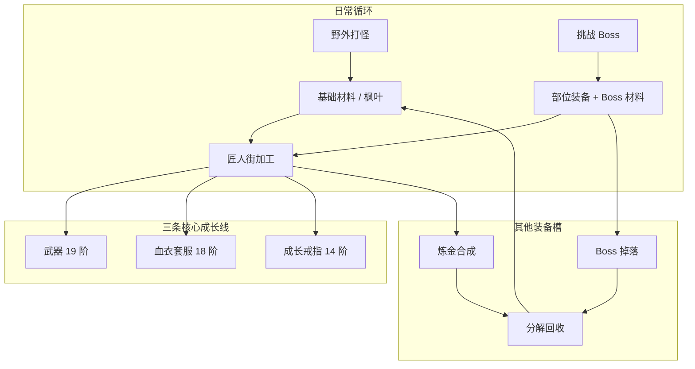
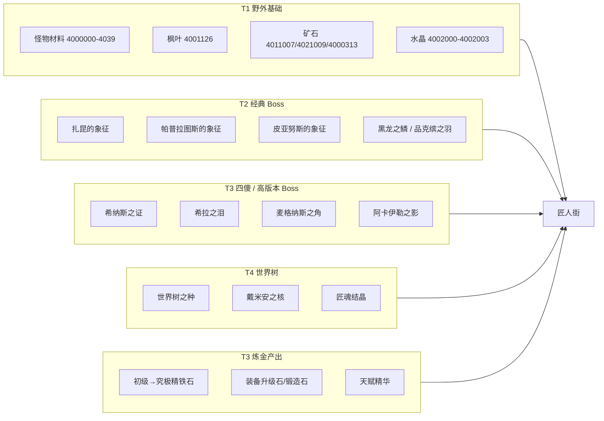
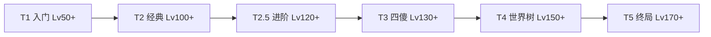

# 萧曳083改079冒险岛玩法

> **版本**：v0.1 规划稿  
> **适用服务端**：BeiDou-Server_xy（GMS v083 内核 + 079 高版本内容移植）  
> **核心地图**：匠人街 `910001000`  
> **设计目标**：延长养成周期、材料有来有去、三条主线成长清晰，其余装备靠 Boss / 合成补齐  

---

## 目录

1. [设计总览](#1-设计总览)
2. [匠人街 NPC 功能规划](#2-匠人街-npc-功能规划)
3. [三条核心成长线](#3-三条核心成长线)
4. [材料经济体系](#4-材料经济体系)
5. [挑战 Boss 与装备出处](#5-挑战-boss-与装备出处)
6. [高版本 Boss 移植规划](#6-高版本-boss-移植规划)
7. [分阶段实施路线](#7-分阶段实施路线)
8. [技术可行性评估](#8-技术可行性评估)
9. [附录：配置与脚本目录](#9-附录配置与脚本目录)

---

## 1. 设计总览

### 1.1 养成哲学

| 类别 | 策略 | 说明 |
|------|------|------|
| **核心成长** | 武器 + 套服 + 戒指 | 长期主线，链式进阶，属性继承 |
| **其他部位** | Boss 掉落 + 炼金合成 | 帽子/手套/鞋子/披风/腰带/耳环等不做长链 |
| **远征 Boss** | 独有装备 + 专属材料 | 不给武器链成品，避免跳级 |
| **全局货币** | 枫叶 `4001126` | 所有进阶系统的通用消耗 |

### 1.2 整体循环



### 1.3 设计资产来源

| 资产 | 路径 | 用途 |
|------|------|------|
| 武器链配置 | `beidou_client_xiaoye/玩法/武器玩法提示词.txt` | 19 阶武器进阶 |
| 套服链配置 | `beidou_client_xiaoye/玩法/套装血衣玩法.txt` | 血衣 18 阶 + 三路线 |
| 戒指链配置 | `beidou_client_xiaoye/玩法/成长戒指玩法.txt` | 十字旅团戒指链 |
| 材料经济 | `beidou_client_xiaoye/玩法/材料获取途径与用途.docx` | 来源/消耗闭环 |
| UI 参考图 | `beidou_client_xiaoye/玩法/*.png` | 锻造/炼金/洗血/天赋 |
| 旧版脚本库 | `BeiDou-Server-0.0.1/resource_doc/脚本/js/` | 远征/Boss/合成模板 |
| 旧版 Java 系统 | `BeiDou-Server-0.0.1/BeiDouSpecial/` | 装备强化/进阶 DB |

---

## 2. 匠人街 NPC 功能规划

地图：**专业技术村庄〈匠人街〉** `910001000`

### 2.1 NPC 分配总表

| NPC ID | 形象 / 区域 | 功能定位 | 对应玩法资产 | 优先级 |
|--------|------------|---------|-------------|--------|
| **9031000** | 上层·村长小屋 | **远征 Boss 枢纽** | `远征副本.js` | P0 |
| **9031008** | 上层·传送门旁 | **博学大师**：天赋 / 伤害突破 / 技能书 | `制作技能,学习天赋,伤害突破.png` | P1 |
| **9031003** | 下层·铁砧区 | **武器中心**：初始武器 + 19 阶进阶 | `武器玩法提示词.txt` | P0 |
| **9031012** | 铁砧旁 | 工作台入口 → 跳转 9031003 | — | P0 |
| **9031001** | 下层·药草区 | **血衣套服进阶**（伤害/均衡/血量） | `套装血衣玩法.txt` | P0 |
| **9031010** | 药草锅 | 工作台入口 → 跳转 9031001 | — | P0 |
| **9031004** | 下层·宝石区 | **成长戒指中心** + 低级饰品合成 | `成长戒指玩法.txt` | P0 |
| **9031013** | 宝石加工机 | 工作台入口 → 跳转 9031004 | — | P0 |
| **9031005** | 下层·炼金区 | **炼金大师**：精铁石 / 升级石 / 锻造石 / 天赋精华 | `炼金术.png` | P1 |
| **9031014** | 炼金魔法书 | 工作台入口 → 跳转 9031005 | — | P1 |
| **9031002** | 下层·采矿区 | **矿石精炼** + Boss 材料兑换 | `2040016.js` 模板 | P1 |
| **9031011** | 采矿机器 | 工作台入口 → 跳转 9031002 | — | P1 |
| **9031006** | 上层·配方商人 | **配方商店** + 装备分解 + 秘密材料副本门票 | `装备分解列表.js` | P1 |
| **9031007** | 上层·材料商人 | **基础材料商店** | `炼金物品购买.png` | P1 |
| **9031009** | 上层·书架旁 | **匠人街导览** + 回城传送 + 玩法说明 | — | P2 |
| **9031015** | 炼金区旁 | **修炼大师**：洗血洗蓝 / 象征洗血 | `洗血系统.jpg` | P2 |
| **9031016** | 上层·仓库 | **仓库管理员**（083 原生） | — | P0 |

### 2.2 9031000 vs 9031008 分工

| NPC | 职能 | 玩家记忆点 |
|-----|------|-----------|
| **9031000 希梅尔** | 战斗挑战：远征组队、Boss 入口、次数查询 | 「找村长打 Boss」 |
| **9031008 希梅尔** | 角色修炼：天赋、伤害突破、二段跳、技能书 | 「找村长学本领」 |

### 2.3 9031000 远征枢纽菜单结构（规划）

```
希梅尔 - 远征副本
├── 一、入门远征（Lv50+）
│   ├── 蝙蝠怪
│   ├── 扎昆
│   └── 帕普拉图斯
├── 二、经典远征（Lv100+）
│   ├── 暗黑龙王
│   ├── 品克缤
│   └── 进阶扎昆（混沌扎昆）
├── 三、冒险岛四傻（Lv120+）
│   ├── 希纳斯（骑士团皇女）
│   ├── 希拉
│   ├── 麦格纳斯
│   └── 阿卡伊勒
├── 四、世界树系列（Lv140+）
│   ├── 戴米安（世界树顶端）
│   └── 路西德（梦境世界）※ 终局可选
└── 五、其他远征
    ├── 暴力熊 / 心疤狮王
    └── 混沌暗黑龙王
```

---

## 3. 三条核心成长线

> 详细数值以 `玩法/` 目录下三个 `.txt` 为准，此处为规划摘要。

### 3.1 武器线（9031003）

- **领取**：圣诞六翼天使武器系列，10 级，四维+20，不可交易
- **进阶**：共 19 阶，上一阶武器作材料，属性继承 + 增量
- **同类型链式**：单手剑→单手剑，短杖→短杖
- **全局倍率变量**：便于后期整体调控材料消耗

| 阶段 | 代表系列 | 目标等级 | 通用材料 |
|------|---------|---------|---------|
| 0 | 圣诞天使武器 | 10 | 免费领取 |
| 1–4 | 枫叶→4 周年枫叶 | 30–60 | 4011007, 4021009, 4000313, 枫叶 |
| 5–10 | 铂金→革命 | 70–120 | 同上 × 倍率 |
| 11–14 | 扎昆武器→皇家班雷昂 | 130–150 | + Boss 象征材料 |
| 15–19 | 巨匠→创世 | 160–200 | + 高阶远征材料 |

**Boss 材料接入（11 阶起）**

| 武器阶段 | 新增材料 |
|---------|---------|
| 扎昆武器（11） | 扎昆的象征 ×5 |
| 皇家班雷昂（13） | 黑龙之鳞 ×10 |
| 埃苏莱布斯（16） | 品克缤之羽 ×10 |
| 神秘之影（18） | 匠魂结晶 ×20 |
| 创世（19） | 匠魂结晶 ×50 + 四傻象征各 ×3 |

### 3.2 套服线（9031001）

- **购买起点**：`1052165` 降落伞工作人员套装（100W 金币）
- **进阶**：Lv0→Lv18，每次三选一属性路线
- **失败机制**：可配置成功率，失败只扣材料（与武器 100% 兑换区分）

| 路线 | 属性倾向 |
|------|---------|
| 伤害 | 双维+20, HP+100, 攻/魔+15 |
| 均衡 | 双维+15, HP+300, 攻/魔+10 |
| 血量 | 双维+10, HP+600, 攻/魔+8 |

**材料**：`4002000`–`4002003` 四色水晶 + 金币（按阶数递增）

### 3.3 戒指线（9031004）

- **起点**：`1112599` 十字旅团新手戒指
- **终点**：`1112613` 十字旅团降魔戒指
- **材料特点**：`4000000`–`4000039` 全等级段怪物掉落 + 枫叶

> 戒指是唯一「从早期怪就开始积累材料」的主线，不依赖 Boss。

---

## 4. 材料经济体系

### 4.1 材料分层



### 4.2 自定义材料 ID 规划（建议新增）

> 以下 Etc 道具需在服务端 WZ + 客户端 Data 双端同步新增。

| 材料 ID（建议） | 名称 | 主要来源 | 主要用途 |
|----------------|------|---------|---------|
| `4035001` | 扎昆的象征 | 扎昆 / 进阶扎昆 | 洗血、武器 Lv11+ |
| `4035002` | 帕普拉图斯的象征 | 帕普拉图斯 | 洗血、炼金中级配方 |
| `4035003` | 皮亚努斯的象征 | 皮亚努斯 | 洗血、饰品合成 |
| `4035004` | 黑龙之鳞 | 暗黑龙王 / 混沌黑龙 | 套服 Lv12+、腰带合成 |
| `4035005` | 品克缤之羽 | 品克缤 | 套服 Lv16+、披风合成 |
| `4035006` | 希纳斯之证 | 希纳斯 | 四傻套装饰品、勋章合成 |
| `4035007` | 希拉之泪 | 希拉 | 耳环合成、炼金高级配方 |
| `4035008` | 麦格纳斯之角 | 麦格纳斯 | 手套合成、武器 Lv15+ |
| `4035009` | 阿卡伊勒之影 | 阿卡伊勒 | 吊坠合成、套服 Lv17+ |
| `4035010` | 世界树之种 | 戴米安 | 终局腰带/肩饰合成 |
| `4035011` | 戴米安之核 | 戴米安 | 武器 Lv18+、创世材料 |
| `4035012` | 匠魂结晶 | 全部高阶远征 | 武器/套服终局通用材料 |
| `4035013` | 混沌精髓 | 进阶扎昆 / 混沌黑龙 | 混沌卷轴兑换、高级强化 |
| `4021020` | 初级精铁石 | 炼金（卡利安） | 装备锻造 |
| `4021021` | 中级精铁石 | 炼金 | 装备锻造 |
| `4021022` | 高级精铁石 | 炼金 | 装备锻造 |
| `4021023` | 究极精铁石 | 炼金 + 四傻材料 | 终局锻造 |

### 4.3 材料消耗去向总表

| 材料 | 武器 | 套服 | 戒指 | 炼金 | 洗血 | 部位合成 |
|------|:----:|:----:|:----:|:----:|:----:|:--------:|
| 枫叶 | ✓ | ✓ | ✓ | — | — | ✓ |
| 矿石三件套 | ✓ | — | — | ✓ | — | ✓ |
| 四色水晶 | — | ✓ | — | ✓ | — | — |
| 怪物材料 4000xxx | — | — | ✓ | — | — | — |
| 扎昆象征 | ✓ | — | — | ✓ | ✓ | — |
| 黑龙之鳞 | — | ✓ | — | ✓ | — | ✓ |
| 品克缤之羽 | — | ✓ | — | — | — | ✓ |
| 四傻材料 | ✓ | ✓ | — | ✓ | — | ✓ |
| 匠魂结晶 | ✓ | ✓ | — | — | — | ✓ |
| 戴米安之核 | ✓ | — | — | — | — | ✓ |

---

## 5. 挑战 Boss 与装备出处

### 5.1 Boss 难度分层



### 5.2 全 Boss 规划总表

#### T1 — 入门远征（Lv 50–80）

| Boss | Mob ID（参考） | 等级要求 | 人数 | 次数 | 独有装备产出 | 材料产出 |
|------|---------------|---------|------|------|-------------|---------|
| 蝙蝠怪 | `8130100` | Lv50 | 3–6 | 日 2 | 蝙蝠怪手套、蝙蝠怪鞋 | 蝙蝠怪皮碎片 → 混沌卷轴 |
| 扎昆 | `8800000` | Lv50 | 6 | 日 2 | 扎昆头盔、扎昆披风 | 扎昆的象征 `4035001` |
| 帕普拉图斯 | `8500002` | Lv70 | 6 | 日 2 | 帕普拉图斯戒指（非成长链） | 帕普拉图斯的象征 `4035002` |

**装备槽覆盖**：帽子、手套、鞋子、披风、低级戒指

#### T2 — 经典远征（Lv 100–120）

| Boss | Mob ID（参考） | 等级要求 | 人数 | 次数 | 独有装备产出 | 材料产出 |
|------|---------------|---------|------|------|-------------|---------|
| 暗黑龙王 | `8810018` | Lv100 | 6 | 日 1 | 黑龙耳环、黑龙腰带、黑龙手套 | 黑龙之鳞 `4035004` |
| 品克缤 | `8820000` | Lv120 | 6 | 日 1 | 品克缤腰带、品克缤披风、品克缤吊坠 | 品克缤之羽 `4035005` |
| 暴力熊/心疤狮王 | `9420549` 等 | Lv100 | 6 | 日 2 | 梦幻公园耳环、玩具城手套 | 玩具精髓 `4035014` |

**装备槽覆盖**：耳环、腰带、吊坠、披风、手套

#### T2.5 — 进阶经典（Lv 120+）

| Boss | 说明 | 等级要求 | 人数 | 次数 | 独有装备产出 | 材料产出 |
|------|------|---------|------|------|-------------|---------|
| **进阶扎昆（混沌扎昆）** | `ExpeditionType.CHAOS_ZAKUM` | Lv120 | 6 | 周 2 | 混沌扎昆头盔（升级版）、混沌护腕 | 混沌精髓 `4035013`、扎昆的象征 ×2 |
| **混沌暗黑龙王** | `ExpeditionType.CHAOS_HORNTAIL` | Lv120 | 6 | 周 2 | 混沌黑龙项链、混沌黑龙鞋子 | 混沌精髓、黑龙之鳞 ×2 |

> **进阶扎昆定位**：扎昆的「困难模式」，产出更好部位装备 + 混沌精髓（后期强化/卷轴必需），不是武器链跳级捷径。

#### T3 — 冒险岛四傻（Lv 130–150）

> **定义**：079 整合服中高版本主线四座大山 —— 希纳斯、希拉、麦格纳斯、阿卡伊勒。  
> 玩家俗称「四傻」，难度递进，各自负责不同装备槽位与材料。

| Boss | 背景 | 等级要求 | 人数 | 次数 | 独有装备产出 | 材料产出 |
|------|------|---------|------|------|-------------|---------|
| **希纳斯**（Cygnus） | 骑士团皇女，圣地 | Lv130 | 6 | 周 2 | 希纳斯皇冠（帽子）、希纳斯手套、希纳斯鞋子 | 希纳斯之证 `4035006` |
| **希拉**（Hilla） | 死者之殿女王 | Lv135 | 6 | 周 2 | 希拉耳环、希拉吊坠、希拉腰带 | 希拉之泪 `4035007` |
| **麦格纳斯**（Magnus） | 暴君，赫里希安 | Lv140 | 6 | 周 1 | 麦格纳斯肩饰、麦格纳斯手套、麦格纳斯披风 | 麦格纳斯之角 `4035008` |
| **阿卡伊勒**（Arkarium） | 时间神殿守护者 | Lv150 | 6 | 周 1 | 阿卡伊勒吊坠、阿卡伊勒腰带、阿卡伊勒勋章胚 | 阿卡伊勒之影 `4035009` |

**四傻装备槽分工**

| Boss | 主产出槽位 | 副产出 |
|------|-----------|--------|
| 希纳斯 | 帽子、手套、鞋子 | 希纳斯之证 |
| 希拉 | 耳环、吊坠 | 希拉之泪 |
| 麦格纳斯 | 肩饰、手套、披风 | 麦格纳斯之角 |
| 阿卡伊勒 | 腰带、吊坠、勋章 | 阿卡伊勒之影 |

**四傻材料用途**

| 材料 | 用途 |
|------|------|
| 希纳斯之证 | 炼金「中级精铁石」、勋章合成、套服 Lv14+ |
| 希拉之泪 | 耳环炼金合成、炼金「高级精铁石」 |
| 麦格纳斯之角 | 武器 Lv15+、手套 Boss 装升级 |
| 阿卡伊勒之影 | 套服 Lv17+、吊坠终局合成 |

#### T4 — 世界树系列（Lv 150–170）

| Boss | 背景 | 等级要求 | 人数 | 次数 | 独有装备产出 | 材料产出 |
|------|------|---------|------|------|-------------|---------|
| **戴米安**（Damien） | 世界树顶端，毁灭骑士 | Lv150 | 6 | 周 1 | 世界树之冠（帽子）、世界树腰带、世界树手套 | 世界树之种 `4035010`、戴米安之核 `4035011` |
| **路西德**（Lucid） | 梦境之主，可选终局 | Lv170 | 6 | 周 1 | 梦境披风、梦境耳环、梦境戒指（非成长链） | 梦境碎片 `4035015`、匠魂结晶 ×3 |

> **世界树 Boss 定位**：戴米安是四傻之后的第一个「世界线」Boss，产出当前版本顶级散件，但不替代三条核心成长线终点。

#### T5 — 终局挑战（Lv 170+，可选）

| Boss | 说明 | 产出 |
|------|------|------|
| 威尔（Will） | 镜世界 | 终局肩饰、特殊时装 |
| 黑魔法师（简化版） | 全服活动 Boss | 限定称号、匠魂结晶大量 |

### 5.3 装备槽位 × Boss 产出矩阵

| 装备槽 | T1 入门 | T2 经典 | T2.5 进阶 | T3 四傻 | T4 世界树 | 炼金合成 |
|--------|--------|--------|----------|--------|----------|---------|
| 武器 | — | — | — | — | — | **武器链（匠人街）** |
| 套服 | — | — | — | — | — | **血衣链（匠人街）** |
| 戒指（成长） | — | — | — | — | — | **戒指链（匠人街）** |
| 帽子 | 扎昆头盔 | — | 混沌扎昆头盔 | 希纳斯皇冠 | 世界树之冠 | 精铁石合成 |
| 脸饰 | — | — | — | — | — | 活动 / 商城 |
| 眼饰 | — | — | — | — | — | 活动 / 商城 |
| 耳环 | — | 黑龙耳环 | — | 希拉耳环 | 梦境耳环 | 希拉之泪合成 |
| 吊坠 | — | 品克缤吊坠 | — | 阿卡伊勒吊坠 | — | 阿卡伊勒之影合成 |
| 披风 | 扎昆披风 | 品克缤披风 | — | 麦格纳斯披风 | 梦境披风 | 品克缤之羽合成 |
| 腰带 | — | 黑龙腰带 | — | 希拉/阿卡伊勒腰带 | 世界树腰带 | 黑龙之鳞合成 |
| 手套 | 蝙蝠怪手套 | 黑龙手套 | 混沌护腕 | 希纳斯/麦格纳斯手套 | 世界树手套 | 麦格纳斯之角合成 |
| 鞋子 | 蝙蝠怪鞋 | — | 混沌黑龙鞋 | 希纳斯鞋 | — | — |
| 肩饰 | — | — | — | 麦格纳斯肩饰 | — | 终局合成 |
| 勋章 | — | — | — | 阿卡伊勒勋章胚 | — | 四傻材料合成 |

### 5.4 Boss 挑战规则（统一）

| 规则项 | 建议值 | 说明 |
|--------|--------|------|
| 入门 Boss 次数 | 每日 2 次 | 扎昆、蝙蝠怪、帕普拉图斯 |
| 经典 Boss 次数 | 每日 1 次 | 黑龙、品克缤 |
| 进阶 / 四傻 / 世界树 | 每周 1–2 次 | 高价值产出，控制通胀 |
| 入场券 | 部分 Boss 需消耗道具 | 如扎昆需要远征眼 |
| 组队要求 | 参考 `ExpeditionType` | 可配置 `use_enable_solo_expeditions` |
| 等级门槛 | 见上表 | 低于门槛 NPC 拒绝入场 |
| 战力门槛（可选） | 四傻+ 建议加 | 防止纯混子，脚本检测攻击力/血量 |

### 5.5 次数与记录

- 使用 `bosslog_daily` / `bosslog_weekly` 表
- 游戏配置：`use_enable_daily_expeditions`（建议 Phase 3 开启）
- 每个 Boss 独立 log key，如 `zakum`、`chaos_zakum`、`hilla`、`damien`

---

## 6. 高版本 Boss 移植规划

### 6.1 移植可行性分级

| Boss | 客户端资源 | 服务端事件 | 难度 | 建议阶段 |
|------|-----------|-----------|------|---------|
| 扎昆 / 黑龙 / 品克缤 | ✅ 083 原生 | ✅ 已有 Battle 脚本 | 低 | Phase 1 |
| 进阶扎昆 / 混沌黑龙 | ⚠️ 需 Chaos 皮肤 WZ | ⚠️ 枚举已有，缺 NPC 脚本 | 低 | Phase 1 |
| 帕普拉图斯 | ⚠️ 需确认 Mob WZ | ❌ 缺远征脚本 | 中 | Phase 2 |
| 希纳斯 | ❌ 需移植 Mob/Map | ❌ 需新事件脚本 | 中 | Phase 3 |
| 希拉 | ❌ 需移植 | ❌ 参考 `希拉.js` | 中高 | Phase 3 |
| 麦格纳斯 | ❌ 需移植 | ❌ 参考 `麦格纳斯.js` | 中高 | Phase 3 |
| 阿卡伊勒 | ❌ 需移植 | ❌ 参考 `阿卡伊勒.js` | 高 | Phase 4 |
| 戴米安（世界树） | ❌ 需移植 | ❌ 需新做 | 高 | Phase 4 |
| 路西德 | ❌ 需移植 | ❌ 需新做 | 很高 | Phase 5 可选 |

### 6.2 单个高版本 Boss 移植清单

以 **希拉** 为例（四傻中第一个建议实装）：

| 步骤 | 内容 | 路径 |
|------|------|------|
| 1 | 移植 Mob WZ | `Mob.wz` → 客户端 Data + 服务端 wz |
| 2 | 移植 Boss 地图 | `Map.wz` → 双端同步 |
| 3 | 编写事件脚本 | `scripts-zh-CN/event/HillaBattle.js` |
| 4 | 编写 NPC 入口 | 9031000 子菜单 or 独立 NPC |
| 5 | 配置掉落 | `drop_data` 表 + 独有装备 WZ |
| 6 | 新增材料道具 | `4035007` 希拉之泪 Etc WZ |
| 7 | 新增装备道具 | 希拉耳环/吊坠等 Character + String WZ |
| 8 | 测试 | 组队、次数、掉落、地图传送 |

### 6.3 进阶扎昆（近期优先）

| 项目 | 现状 | 动作 |
|------|------|------|
| 远征类型 | `CHAOS_ZAKUM` 已在 `ExpeditionType.java` | 直接使用 |
| NPC 脚本 | 无 | 克隆 `2030013.js`，改 `exped = CHAOS_ZAKUM` |
| 事件脚本 | 无 | 克隆 `ZakumBattle.js`，调高 HP/攻击 |
| Mob | `8800102` 等 | 确认 WZ 是否已移植 |
| 掉落 | 无 | 配置混沌装备 + 混沌精髓 |

### 6.4 世界树 Boss — 戴米安

| 项目 | 规划 |
|------|------|
| 背景 | 世界树被毁灭骑士戴米安侵蚀，玩家组队登顶挑战 |
| 地图 | 需从 079 客户端移植 `Map.wz` 世界树系列 |
| 机制（简化版） | 两阶段：P1 戴米安骑士 → P2 戴米安真身；无复杂平台机制 |
| 产出定位 | 当前版本顶级散件（帽子/腰带/手套）+ 戴米安之核 |
| 准入 | 四傻全通成就 or 阿卡伊勒击杀 3 次 |
| 次数 | 每周 1 次 |

### 6.5 四傻递进关系


**准入建议（可选成就门槛）**

| Boss | 前置条件 |
|------|---------|
| 希纳斯 | 击杀品克缤 1 次 |
| 希拉 | 击杀希纳斯 1 次 |
| 麦格纳斯 | 击杀希拉 1 次 |
| 阿卡伊勒 | 击杀麦格纳斯 1 次 |
| 戴米安 | 四傻各击杀 1 次 |
| 路西德 | 击杀戴米安 3 次 |

---

## 7. 分阶段实施路线

### Phase 0 — 基础设施（1–2 周）

- [ ] 导入地图 `910001000`（双端 WZ 同步）
- [ ] 导入 NPC WZ `9031000`–`9031016`
- [ ] 更新 `String.wz/Npc.img.xml` 功能标签
- [ ] 创建 `scripts-zh-CN/npc/xy/匠人街/` 目录结构
- [ ] 新增自定义材料 Etc 道具 WZ（`4035001`–`4035015`）
- [ ] 验证 `9900001新.js` → `cm.warp(910001000)` 可用

### Phase 1 — 核心成长 + 入门 Boss（2–3 周）

- [ ] `9031003` 武器中心（19 阶链）
- [ ] `9031001` 血衣套服进阶
- [ ] `9031004` 成长戒指中心
- [ ] `9031016` 仓库
- [ ] `9031000` 远征枢纽（扎昆 / 黑龙 / 品克缤 / 进阶扎昆）
- [ ] 入门 Boss 掉落表 + 材料配置

### Phase 2 — 材料经济 + 炼金（1–2 周）

- [ ] `9031005` 炼金大师
- [ ] `9031002` 矿石精炼 + 材料兑换
- [ ] `9031006` 分解回收 + 配方商店
- [ ] `9031007` 基础材料商店
- [ ] 部位装备炼金合成（帽子/耳环/腰带/披风）

### Phase 3 — 四傻 + 辅助成长（3–4 周）

- [ ] 移植希纳斯 / 希拉 Mob + Map + 事件
- [ ] 9031000 四傻子菜单
- [ ] 四傻独有装备 WZ + 掉落
- [ ] `9031008` 博学大师（天赋 / 伤害突破）
- [ ] `9031015` 修炼大师（洗血洗蓝）
- [ ] 开启 `use_enable_daily_expeditions`

### Phase 4 — 世界树 + 终局（3–4 周）

- [ ] 移植麦格纳斯 / 阿卡伊勒
- [ ] 移植戴米安（世界树 Boss）
- [ ] 戴米安装备 + 材料产出
- [ ] 武器/套服终局阶段材料接入
- [ ] `9031009` 匠人街导览

### Phase 5 — 打磨扩展（持续）

- [ ] 路西德（可选终局）
- [ ] 时装洗练
- [ ] 装备星力强化（迁旧版 DB）
- [ ] 融合外观（等客户端插件）
- [ ] 全服世界 Boss 活动

---

## 8. 技术可行性评估

### 8.1 纯脚本可实现（推荐一期）

| 功能 | 实现方式 | 难度 |
|------|---------|------|
| 武器/套服/戒指链式进阶 | NPC 脚本 + 属性继承 | ⭐⭐ |
| 远征 Boss 入口 | 克隆 `2083004.js` + `ExpeditionType` | ⭐ |
| Boss 独有掉落 | `drop_data` 表 | ⭐ |
| 矿石精炼 | 克隆 `2040016.js` | ⭐ |
| 材料商店/兑换 | 标准 shop 脚本 | ⭐ |
| 洗血洗蓝 | 改 maxHp/maxMp + 扣材料 | ⭐⭐ |
| 仓库 | `cm.openStorage` | ⭐ |
| 装备分解 | 扣装备 → 给材料 | ⭐⭐ |
| 部位装备炼金合成 | 材料兑换脚本 | ⭐⭐ |
| Boss 次数限制 | `bosslog_daily/weekly` | ⭐ |

### 8.2 需 Java 扩展或迁旧版 DB（二期）

| 功能 | 现状 | 建议 |
|------|------|------|
| 装备星力强化 | `EquipEnhanceManager` 存在，配置为空 | 迁 `xy_equip_enhance_config` |
| 装备职业分线进阶 | `EquipAdvanceManager` 有 12 路线 | 作武器链补充 |
| 卡片/玩具收集 | 旧版有 DB 表 | 后期扩展 |
| 自定义 Boss HP 条 | `customShowBossHP` 已有 | 四傻+ 直接用 |

### 8.3 需客户端插件（暂不建议一期）

| 功能 | 原因 | 替代方案 |
|------|------|---------|
| 官方专业技术 UI | 083 无 Production Skill 面板 | 脚本对话框代替 |
| 星力强化动画 | 无原生 UI | 脚本文本确认 |
| 融合外观 UI | 客户端 Phase C 未完成 | 后期插件 |
| 宝石镶嵌 UI | 需 socket 显示 | 脚本「伪镶嵌」写属性 |
| 高版本 Boss 技能特效 | 缺 Skill WZ | 简化机制，保留外观 |

### 8.4 旧版脚本移植注意

`BeiDou-Server-0.0.1/resource_doc/脚本/js/` 部分 API 需适配：

| 旧版 API | 处理方式 |
|----------|---------|
| `get每日记录` / `set每日记录` | 改用 `cm.getBossLog` 或 quest 记录 |
| `GetCombat` | 改用等级 / 攻击力检测 |
| `getBossRank6` | 砍掉或自写 Java |
| `元宝` 货币 | 改用枫叶 / 金币 / 自定义道具 |

---

## 9. 附录：配置与脚本目录

### 9.1 脚本目录结构（规划）

```
gms-server/scripts-zh-CN/npc/
├── 9031000.js              → openNpc("xy/匠人街/远征枢纽")
├── 9031001.js              → openNpc("xy/匠人街/血衣进阶")
├── 9031003.js              → openNpc("xy/匠人街/武器中心")
├── 9031004.js              → openNpc("xy/匠人街/戒指中心")
├── 9031005.js              → openNpc("xy/匠人街/炼金大师")
├── 9031008.js              → openNpc("xy/匠人街/博学大师")
├── 9031015.js              → openNpc("xy/匠人街/修炼大师")
├── 9031016.js              → 仓库（标准脚本）
└── xy/匠人街/
    ├── 远征枢纽.js
    ├── 远征/
    │   ├── 入门远征.js          # 蝙蝠怪/扎昆/闹钟
    │   ├── 经典远征.js          # 黑龙/品克缤
    │   ├── 进阶远征.js          # 混沌扎昆/混沌黑龙
    │   ├── 四傻远征.js          # 希纳斯/希拉/麦格纳斯/阿卡伊勒
    │   └── 世界树远征.js        # 戴米安/路西德
    ├── 武器中心.js
    ├── 武器进阶配置.js
    ├── 血衣进阶.js
    ├── 血衣进阶配置.js
    ├── 戒指中心.js
    ├── 戒指进阶配置.js
    ├── 炼金大师.js
    ├── 炼金配方配置.js
    ├── 部位合成.js
    ├── 部位合成配置.js
    ├── 博学大师.js
    ├── 修炼大师.js
    ├── 材料商店.js
    ├── 分解回收.js
    ├── Boss材料配置.js
    └── 返回匠人街.js
```

### 9.2 与 9900001 枢纽关系

| 入口 | 处理 |
|------|------|
| 「前往匠人街」 | 保留 `cm.warp(910001000)` |
| `xy/装备系统/*` | 合并到匠人街对应 NPC，避免双入口 |
| `xy/挑战/9031000_远征` | 改为 warp 匠人街或 `openNpc(9031000)` |

| 系统 | 职能 |
|------|------|
| **匠人街** | 装备养成一站式中心 |
| **9900001** | 全服功能总枢纽（VIP、签到、传送等） |

### 9.3 相关文档索引

| 文档 | 路径 |
|------|------|
| 本文档 | `resource_doc/萧曳083改079冒险岛玩法.md` |
| 武器链详细配置 | `beidou_client_xiaoye/玩法/武器玩法提示词.txt` |
| 套服链详细配置 | `beidou_client_xiaoye/玩法/套装血衣玩法.txt` |
| 戒指链详细配置 | `beidou_client_xiaoye/玩法/成长戒指玩法.txt` |
| 材料经济 | `beidou_client_xiaoye/玩法/材料获取途径与用途.docx` |
| 改端教学 | `resource_doc/冒险岛改端教学文档.md` |
| 自定义功能总览 | `gms-server/tools/_read_北斗GMS083自定义功能总览.md` |
| 高版本装备移植 | `resource_doc/参考文档/高版本装备IMG移植GMS083全流程...md` |

---

## 附录：无尽辉耀套装排障（2026-07-19）

| 部位 | ID（战/法/弓/飞/海） | 说明 |
|------|---------------------|------|
| 帽 | `1005980`–`1005984` | String 已有；reqJob 正常 |
| 披风 | `1103433`–`1103437` | 客户端 Eqp 曾缺名 → 已 MCP 从服务端 XML 补入 |
| 上衣 | `1042433`–`1042437` | 正常 |
| 手套 | `1082760`–`1082764` | 飞侠 `1082763` 客户端曾错成 `reqJob=2`（法师）；修好文件见 `01082763_fixed8.img`，需关客户端后替换 |
| 裤 | `1062285`–`1062289` | 正常 |
| 鞋 | `1073629`–`1073633` | Eqp 缺名已补 |
| 护肩 | `1152212`–`1152216` | Client_1 曾无 live `0115*`；已 MCP 写回并借 `01152086` 图标；ijl15 `AttachShoulderSlotsFix` 仍 HARD-OFF |

**职业位：** `1`战 `2`法 `4`弓 `8`飞 `16`海。截图披风高亮法师属 `1103434` 本身，不是飞侠手套串线。

**待你操作：** 完全退出 `BeiDou.exe` 后运行  
`python gms-server/tools/_apply_01082763_after_close.py`，再进游戏悬停飞侠手套确认高亮飞侠。

---

## 变更记录

| 版本 | 日期 | 说明 |
|------|------|------|
| v0.1.1 | 2026-07-19 | 附录：无尽辉耀缺名 / 手套 reqJob / 护肩 0115 排障 |
| v0.1 | 2026-07-12 | 初稿：匠人街规划 + Boss 分层 + 四傻/世界树/进阶扎昆 |
